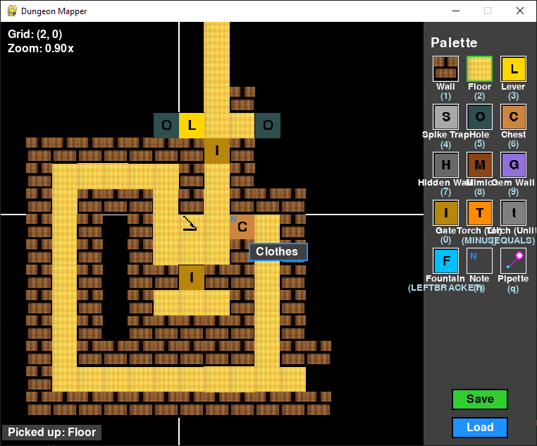

# Dungeon Mapper

A simple grid-based tool for mapping out dungeon layouts in video games.

## Screenshots


*Screenshot of the Dungeon Mapper application showing the grid, palette, and a sample map.*

## Features

- Infinite grid for creating dungeon maps
- 15+ tile types including walls, floors, traps, and interactive objects
- Scrollable palette for selecting tile types with hotkeys for quick access
- Left-click to paint, right-click to erase
- Click and drag to paint/erase multiple tiles at once
- Camera navigation with arrow keys or middle mouse button dragging
- Zoom in/out with mouse wheel to view more or less detail
- Save and load maps with .dungeon file format

## Requirements

- Python 3.6+
- Pygame 2.0+ (will work with 1.9.x but some features may be limited)

## Installation

1. Make sure you have Python installed. If not, download and install it from [python.org](https://python.org).

2. Install Pygame using pip:
   ```
   pip install pygame
   ```

## Running the Application

To run the dungeon mapper, navigate to the project directory in your terminal and run:

```
python main.py
```

## How to Use

### Basic Controls
- Select a tile type from the palette on the right side
- Left-click on the grid to place the selected tile
- Right-click to erase tiles (set to empty)
- Click and drag to paint or erase multiple tiles at once
- Use number keys (1-9, 0, etc.) as hotkeys to quickly select tile types

### Navigation
- Middle-click and drag to pan the camera
- Use arrow keys or WASD to move the camera
- Use mouse wheel to zoom in and out
- Press spacebar to center the view on the origin (0,0)

### Save/Load
- Use the Save button or Ctrl+S to save your map
- Use the Load button or Ctrl+L to load a saved map

## Available Tile Types

- Wall
- Floor
- Lever
- Spike Trap
- Hole
- Chest
- Hidden Wall
- Mimic
- Gem Wall
- Gate
- Torch (Lit/Unlit)
- Fountain
- Entrance (fixed at position 0,0)

## Graphics

The application looks for tile images in the `tiles` folder. Default graphics for all tile types will be created automatically if they don't already exist.

You can add your own custom graphics by placing your images in the `tiles` folder with corresponding filenames (e.g., `wall.png`, `floor.png`, etc.).

The program will load your custom graphics on startup. For best results, use square images (recommended 40x40 pixels, but any size will be scaled to fit).

## Future Features

- Add notes to specific areas
- Export maps as images
- Custom grid layout tools
- Improved tile graphics 

## Credits

This project's code and documentation were generated with the assistance of Claude 3.7 Sonnet AI, an Anthropic thinking model. The AI helped with code optimization, feature implementation, debugging, and documentation creation. 